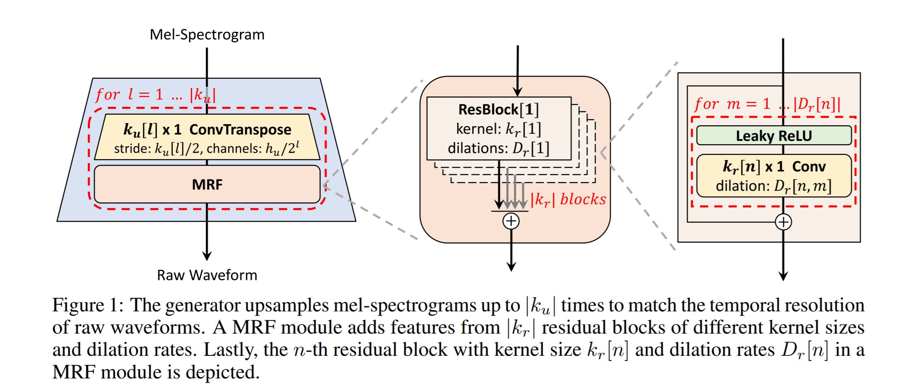
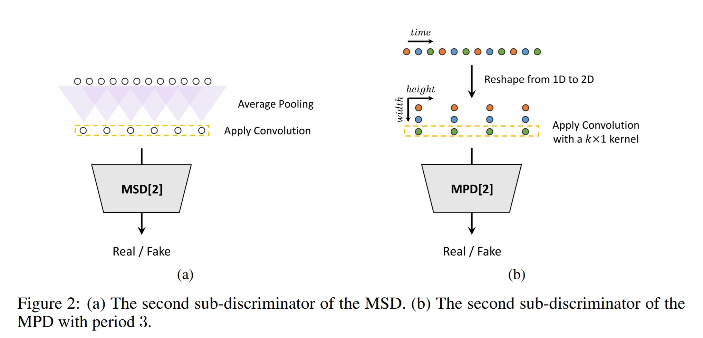
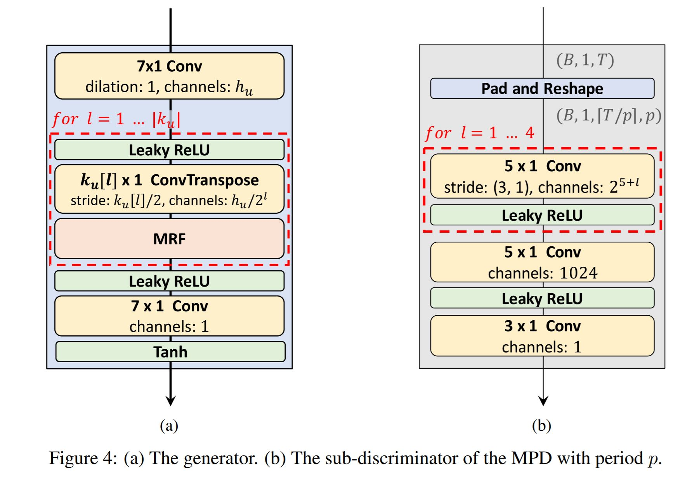

# HiFi-GAN: Generative Adversarial Networks for Efficient and High Fidelity Speech Synthesis [WIP]

Unofficial PyTorch implementation of [HiFi-GAN: Generative Adversarial Networks for Efficient and High Fidelity Speech Synthesis](https://arxiv.org/abs/2010.05646).
<br>**HiFi-GAN :**

<br>


<br>


## Prerequisites

Tested on Python 3.6
```bash
pip install -r requirements.txt
```

## Prepare Dataset

- Download dataset for training. This can be any wav files with sample rate 22050Hz. (e.g. LJSpeech was used in paper)
- preprocess: `python preprocess.py -c config/default.yaml -d [data's root path]`
- Edit configuration `yaml` file

## Train & Tensorboard

- `python trainer.py -c [config yaml file] -n [name of the run]`
  - `cp config/default.yaml config/config.yaml` and then edit `config.yaml`
  - Write down the root path of train/validation files to 2nd/3rd line.
  - Each path should contain pairs of `*.wav` with corresponding (preprocessed) `*.mel` file.
  - The data loader parses list of files within the path recursively.
- `tensorboard --logdir logs/`

## Pretrained model
Check out [here](https://drive.google.com/drive/folders/12XX1QB9LzzMC4pdC_k8EWdvfKDhoEOa9?usp=sharing).

## Inference

- `python inference.py -p [checkpoint path] -i [input mel path]`
